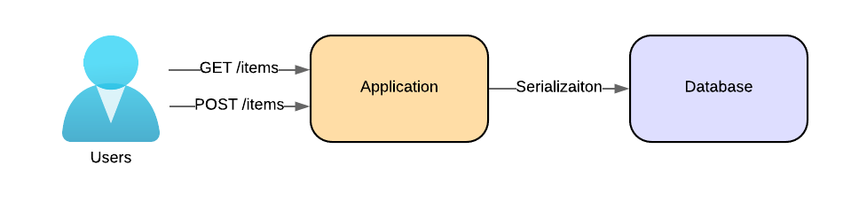
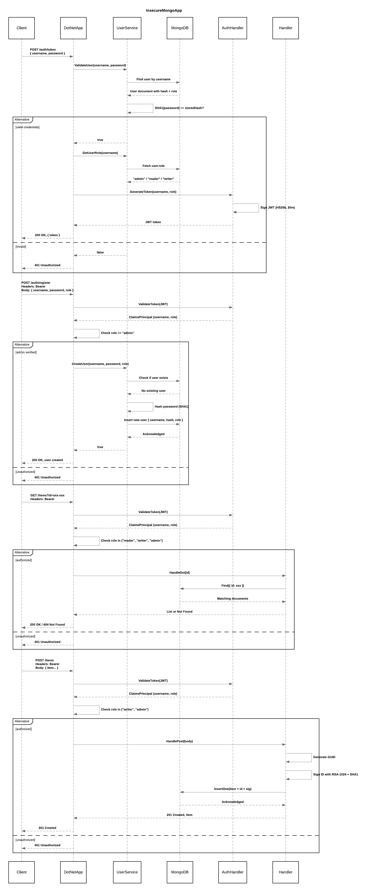

# 🛡️ InsecureMongoApp

A containerized ASP.NET Core application with a MongoDB backend — designed for secure development training and assessment.

---

## 📋 Assignment & Deliverables Table

| Assignment                                                                 | Deliverable                                                                 | Note                                                                                             |
|---------------------------------------------------------------------------|-----------------------------------------------------------------------------|--------------------------------------------------------------------------------------------------|
| Perform threat modeling using the Threat Modeling Template                | Completed threat modeling template                                          |                                                                                                  |
| Run Gitleaks and Snyk scans in Docker [see Security Scanning](#-security-scanning)            | Security findings and fix validation via Gitleaks and Snyk reports (ignore or resolve issues) | 1. Early feedback from security tools after the code modifications  <br> 2. Snyk issues should be ignored in the UI |
| Identify and document security issues across the stack                   | A security assessment write-up in [`SECURITY.md`](SECURITY.md)                             | Include issues from both code, dependencies, and container                                       |
| Apply secure coding principles                                            | Remediated issues reflected in updated code and documentation               |                                                                                                  |
| Validate fixes through re-scanning and documented reports                | Final Gitleaks/Snyk reports and a write-up in `SECURITY.md`                |                                                                                                  |


## 🧰 Tech Stack

- Python 3.11
- MongoDB 6.0
- Docker & Docker Compose
- Mongo Express GUI
- Swagger (OpenAPI)
- Gitleaks
- Snyk

---


## Architecture

Data Flow Diagram:


Sequence Diagram:


---

## 🧪 Setup Instructions

### Prerequisites

Ensure the following tools are installed:

#### ✅ Docker
Install from [https://www.docker.com/products/docker-desktop](https://www.docker.com/products/docker-desktop)

#### ✅ Python (for local debugging)

On macOS:

```bash
brew install python@3.11
```

On Windows/Linux: [https://www.python.org/downloads/release/python-31113/](https://www.python.org/downloads/release/python-31113/)

---

## ▶️ Running the Project

Use Docker Compose to build and start all services:

```bash
docker compose up --build
```

### Available Services

| Service           | URL                    | Description              |
|-------------------|------------------------|--------------------------|
| Application       | http://localhost:8000  | Swagger UI and endpoints |
| Mongo Express GUI | http://localhost:8081  | Web view into MongoDB    |

---

## 📘 Swagger UI

Once running, the application exposes Swagger documentation and testing tools at:

**🔗 [http://localhost:8000/apidocs](http://localhost:8000/apidocs)**

You can:
- Explore the API
- Try requests interactively
- Authenticate via Bearer tokens (for protected endpoints)

---

## 🔍 Security Scanning

### 1️⃣ Gitleaks (Secret Detection)

```bash
docker run --rm -v $(pwd):/path zricethezav/gitleaks:latest detect -s /path -v
```

---

### 2️⃣ Snyk (Vulnerability Scanning)

Authenticate:

```bash
export SNYK_TOKEN=<your_token>
```

Run Snyk tests:

```bash
# Code + dependencies
docker run --rm -it \
  -e SNYK_TOKEN=$SNYK_TOKEN \
  -v $(PWD):/app snyk/snyk:python \
  snyk code test --all-projects

docker run --rm -it \
  -e SNYK_TOKEN=$SNYK_TOKEN \
  -v $(PWD):/app snyk/snyk:python \
  snyk test

# Container scan
docker build -t insecuremongoapp-app .
docker run --rm -it \
  -e SNYK_TOKEN=$SNYK_TOKEN \
  -v /var/run/docker.sock:/var/run/docker.sock \
  snyk/snyk:docker \
  snyk container test insecuremongoapp-app:latest
```

---

## 🧪 Running Tests

```bash
poetry run pytest tests/ -v
```

Tests are also run in CI via GitHub Actions.

---

## ⚠️ Important

This project is intended for **educational and training purposes only**.
Do not use in production environments.
